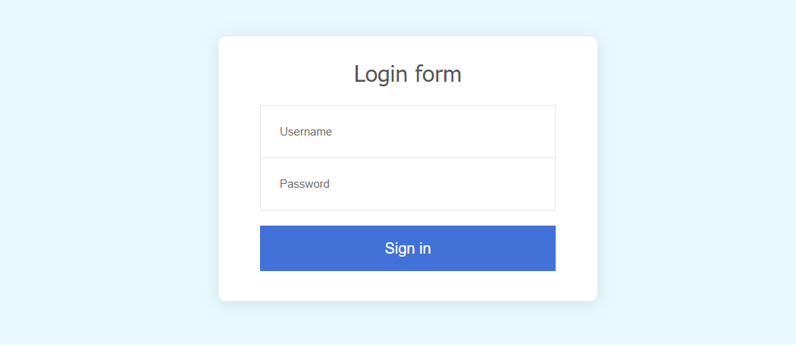
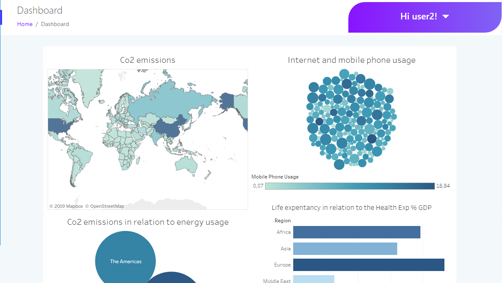

# Tableau WebApp with Flask backend
Web Server with Python Flask back-end and authentication, with login and a Tableau dashboard management.

# Usage
You just need to launch the main.py script. It will start a web server on localhost:5000.
There's need to be a Tableau server running on 10.0.55.1  (otherwise you'll have to change the address in the files)
```
Login example:
username:   user1
password:   yourpassword
```
# Login form example


# Dashboard page example


# Built with
- Python 3 (Flask framework)
- Tableau (Rest API and JS API)
- HTML / CSS / JS

